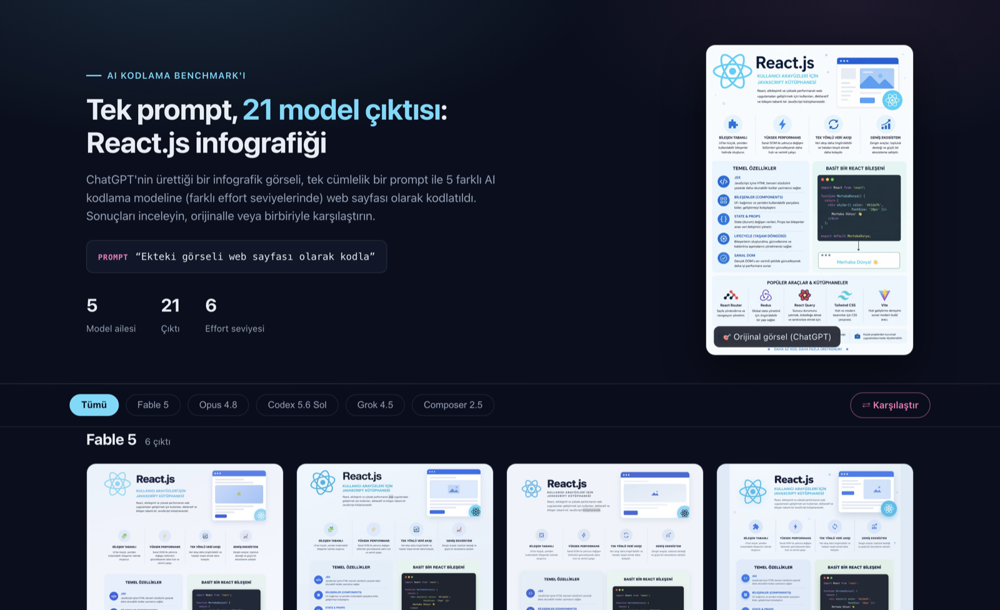

# Tek prompt, 21 model çıktısı: React.js infografiği

**🔗 Canlı site:** [zaferayan.github.io/test-ui](https://zaferayan.github.io/test-ui/)

ChatGPT'nin ürettiği bir React.js infografik görseli ([`_original/ss.png`](_original/ss.png)),
tek cümlelik bir prompt ile 5 farklı AI kodlama modeline — farklı effort seviyelerinde —
web sayfası olarak kodlatıldı:

> **PROMPT:** "Ekteki görseli web sayfası olarak kodla"

Site üzerinde tüm çıktıları inceleyebilir, canlı demolarını açabilir ve herhangi ikisini
(orijinal görsel dahil) **kaydırıcı** ya da **senkron kaydırmalı yan yana** modda
karşılaştırabilirsiniz. Karşılaştırma durumu URL'e yazılır; örneğin
[orijinal vs Fable 5 Max](https://zaferayan.github.io/test-ui/#cmp=_original~fable-5-ef-5-max~slider)
gibi bir linki doğrudan paylaşabilirsiniz.

## Test edilen modeller

| Model ailesi | Effort seviyeleri | Çıktı |
|---|---|---|
| Fable 5 | Low · Medium · High · XHigh · Max · Ultra | 6 |
| Opus 4.8 | Low · Medium · High · XHigh · Max | 5 |
| Codex 5.6 Sol | Low · Medium · High · XHigh · Ultra | 5 |
| Grok 4.5 | Low · Medium · High | 3 |
| Composer 2.5 | Fast · Normal | 2 |

## Klasör yapısı

- [`_original/`](_original/) — referans görsel (`ss.png`) ve prompt (`PROMPT.md`)
- `<model>-ef-<n>-<effort>/` — her çıktının ekran görüntüsü (`ss.png`) ve modelin ürettiği sayfa
- [`thumbs/`](thumbs/) — galeri için küçültülmüş önizlemeler
- [`index.html`](index.html) — karşılaştırma sitesi (tek dosya, framework'süz)

## Notlar

- Ekran görüntüleri her modelin ürettiği sayfadan alındı; çıktılara elle müdahale edilmedi
  (tek istisna: Codex Medium'un Vite build'indeki mutlak `/assets/` yolları, demo alt
  klasörden açılabilsin diye göreceli yola çevrildi).
- Codex High ve XHigh çıktıları Next.js (SSR) uygulaması olduğundan statik canlı demoları yok.
- Tüm çıktılar aynı gün, aynı prompt ve aynı referans görselle üretildi (Temmuz 2026).
